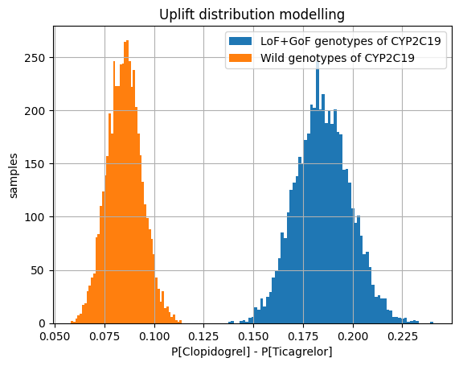

# uplift-modelling

the aim of the project is to model risk increase in patients with uplift modelling

Results
- Data was preprocessed
    - imputed
    - analyzed for outliers
    - splitted 
- Prognostic model (CatBoost) for risk prediction was developed and evaluated
- The impact of medicine intake was modelled. Receptivity of patients to a particular medicine was discovered.

The main result represented on the graph:

